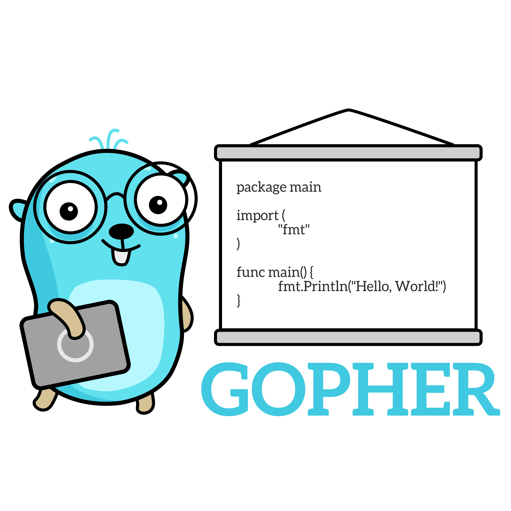

# The Ultimate Go Study Guide

      

> [The Ultimate Go Study Guide eBook version →](https://gum.co/bpUYF)
>
> [101+ coding interview problems with detailed solutions, test cases, and program analysis →](https://github.com/hoanhan101/algo)
>
> [Join my mailing list to get the latest updates here →](https://tinyletter.com/hoanhan)

## Context

> Last updates is on August 2020.

A year ago, in August 2019, I shared this Ultimate Go Study Guide project on GitHub, and surprisingly, it got a lot of attention from the community. Fast forward to August 2020, it now has over 11K stars, 900 forks with the help of more than 20 contributors.

The project is a collection of my notes while learning Go programming language from [Ardan Labs's Ultimate Go course](https://www.oreilly.com/library/view/ultimate-go-programming/9780134757476/). Honestly, I couldn’t thank Bill Kennedy and the Ardan Labs team enough for open-sourcing this wonderful material. They’ve done such great jobs putting together their knowledge, insights into their courses and making them available to the public.

Different people have different learning styles. For me, I learn best by doing and walking through examples. That said, I take notes carefully, comment directly on the source code to make sure that I understand every single line of code as I am reading and also be mindful of the theories behind the scene.

As Ultimate Go Study Guide keeps growing, there’s one issue that keeps coming up. That’s about the format of the project. Specifically, many people have requested an eBook version where the content is more streamlined and they can read it at their convenience.

So, here comes The Ultimate Go Study Guide eBook version. For the last 3 months or so, I have spent most of my free time putting together everything here into a 200-page book. Other than all the good stuff from Ultimate Go, two new and better things in this version are:

* Follow-along code input and output.
* Diagrams.

Hope it makes your journey of learning Go a bit easier. And again, thank you all for your support. I really appreciate it.

**Here’s the link for the book:** [https://gum.co/bpUYF](https://gum.co/bpUYF)**.**

Note that I’ve made it free, though I would really appreciate your support. Regardless, you will receive the book in 2 different formats: PDF and ePub.

## Table of Contents

* **Design Philosophy**:

  [Guideline](https://github.com/ardanlabs/gotraining/blob/master/topics/go/README.md)

* **Language Mechanics**
  * **Syntax**
    * Variable: [Built-in types \| Zero value concept \| Initialization \| Conversion vs Casting](https://github.com/520ignite/ultimate-go/tree/211a3d35f11944000532c180e4409776f12bd572/go/language/variable.go)
    * Struct: [Initialization \| Name type vs Anonymous type](https://github.com/520ignite/ultimate-go/tree/211a3d35f11944000532c180e4409776f12bd572/go/language/struct.go)
    * Pointer: 
      * [Passing by value \| Escape analysis \| Stack space \| Garbage Collection](https://github.com/520ignite/ultimate-go/tree/211a3d35f11944000532c180e4409776f12bd572/go/language/pointer.go)
      * [Golang's Code Review Receiver Type](https://github.com/golang/go/wiki/CodeReviewComments#receiver-type)
    * Constant: [Initialization \| iota](https://github.com/520ignite/ultimate-go/tree/211a3d35f11944000532c180e4409776f12bd572/go/language/constant.go)
    * Function: [Initialization](https://github.com/520ignite/ultimate-go/tree/211a3d35f11944000532c180e4409776f12bd572/go/language/function.go)
  * **Data Structures**
    * Array: [CPU Cache \| TLB \| Initialization \| Iteration \| Type array \| Contiguous memory allocation](https://github.com/520ignite/ultimate-go/tree/211a3d35f11944000532c180e4409776f12bd572/go/language/array.go)
    * Slice: [Initialization \| Length vs Capacity \| Reference Type \| Appending \| Slice of Slice \| Copy of Slice \| UTF-8](https://github.com/520ignite/ultimate-go/tree/211a3d35f11944000532c180e4409776f12bd572/go/language/slice.go)
    * Map: [Initialization \| Iteration \| Deleting \| Finding \| Restriction ](https://github.com/520ignite/ultimate-go/tree/211a3d35f11944000532c180e4409776f12bd572/go/language/map.go)
  * **Decoupling**
    * Method: 
      * [Value and Pointer Receiver Call](https://github.com/520ignite/ultimate-go/tree/211a3d35f11944000532c180e4409776f12bd572/go/language/method_1.go)
      * [Value and Pointer Semantics](https://github.com/520ignite/ultimate-go/tree/211a3d35f11944000532c180e4409776f12bd572/go/language/method_2.go)
      * [Methods are just functions \| Function variable](https://github.com/520ignite/ultimate-go/tree/211a3d35f11944000532c180e4409776f12bd572/go/language/method_3.go)
    * Interface: 
      * [Valueless type \| Concrete type vs Interface type \| Relationship \| Polymorphic function](https://github.com/520ignite/ultimate-go/tree/211a3d35f11944000532c180e4409776f12bd572/go/language/interface_1.go)
      * [Interface via Pointer Receiver \| Method set \| Slice of Interface](https://github.com/520ignite/ultimate-go/tree/211a3d35f11944000532c180e4409776f12bd572/go/language/interface_2.go)
    * Embedding: 
      * [Declaring fields, NOT Embedding](https://github.com/520ignite/ultimate-go/tree/211a3d35f11944000532c180e4409776f12bd572/go/language/embedding_1.go)
      * [Embedding type \| Inner type promotion](https://github.com/520ignite/ultimate-go/tree/211a3d35f11944000532c180e4409776f12bd572/go/language/embedding_2.go)
      * [Embedded type and Interface](https://github.com/520ignite/ultimate-go/tree/211a3d35f11944000532c180e4409776f12bd572/go/language/embedding_3.go)
      * [Outer and inner type implementing the same Interface](https://github.com/520ignite/ultimate-go/tree/211a3d35f11944000532c180e4409776f12bd572/go/language/embedding_4.go)
    * Exporting:
      * [Guideline]()
      * [Exported identifier](https://github.com/520ignite/ultimate-go/tree/211a3d35f11944000532c180e4409776f12bd572/go/language/exporting/exporting_1/README.md)
      * [Accessing a value of an unexported identifier](https://github.com/520ignite/ultimate-go/tree/211a3d35f11944000532c180e4409776f12bd572/go/language/exporting/exporting_2/README.md)
      * [Unexported fields from an exported struct](https://github.com/520ignite/ultimate-go/tree/211a3d35f11944000532c180e4409776f12bd572/go/language/exporting/exporting_3/README.md)
      * [Exported types with embedded unexported types](https://github.com/520ignite/ultimate-go/tree/211a3d35f11944000532c180e4409776f12bd572/go/language/exporting/exporting_4/README.md)
* **Software Design**
  * Composition:

    [Guideline](https://github.com/ardanlabs/gotraining/tree/master/topics/go#interface-and-composition-design)

    * Grouping types: 
      * [Grouping By State](https://github.com/520ignite/ultimate-go/tree/211a3d35f11944000532c180e4409776f12bd572/go/design/grouping_types_1.go)
      * [Grouping By Behavior](https://github.com/520ignite/ultimate-go/tree/211a3d35f11944000532c180e4409776f12bd572/go/design/grouping_types_2.go)
    * Decoupling: 
      * [Struct Composition](https://github.com/520ignite/ultimate-go/tree/211a3d35f11944000532c180e4409776f12bd572/go/design/decoupling_1.go)
      * [Decoupling With Interface](https://github.com/520ignite/ultimate-go/tree/211a3d35f11944000532c180e4409776f12bd572/go/design/decoupling_2.go)
      * [Interface Composition](https://github.com/520ignite/ultimate-go/tree/211a3d35f11944000532c180e4409776f12bd572/go/design/decoupling_3.go)
      * [Decoupling With Interface Composition](https://github.com/520ignite/ultimate-go/tree/211a3d35f11944000532c180e4409776f12bd572/go/design/decoupling_4.go)
    * Conversion: 
      * [Interface Conversions \| Type Assertion](https://github.com/520ignite/ultimate-go/tree/211a3d35f11944000532c180e4409776f12bd572/go/design/conversion_1.go)
      * [Runtime Type Assertion](https://github.com/520ignite/ultimate-go/tree/211a3d35f11944000532c180e4409776f12bd572/go/design/conversion_2.go)
    * Interface Pollution: 
      * [Interface Pollution](https://github.com/520ignite/ultimate-go/tree/211a3d35f11944000532c180e4409776f12bd572/go/design/pollution_1.go)
      * [Remove Interface Pollution](https://github.com/520ignite/ultimate-go/tree/211a3d35f11944000532c180e4409776f12bd572/go/design/pollution_2.go)
    * Mocking: 
      * [Package To Mock](https://github.com/520ignite/ultimate-go/tree/211a3d35f11944000532c180e4409776f12bd572/go/design/mocking_1.go)
      * [Sample Client](https://github.com/520ignite/ultimate-go/tree/211a3d35f11944000532c180e4409776f12bd572/go/design/mocking_2.go)

  * Error Handling: 
    * [Default error values](https://github.com/520ignite/ultimate-go/tree/211a3d35f11944000532c180e4409776f12bd572/go/design/error_1.go)
    * [Error variables](https://github.com/520ignite/ultimate-go/tree/211a3d35f11944000532c180e4409776f12bd572/go/design/error_2.go)
    * [Type as context](https://github.com/520ignite/ultimate-go/tree/211a3d35f11944000532c180e4409776f12bd572/go/design/error_3.go)
    * [Behavior as context](https://github.com/520ignite/ultimate-go/tree/211a3d35f11944000532c180e4409776f12bd572/go/design/error_4.go)
    * [Finding the bug/pitfall of nil value of error interface](https://github.com/520ignite/ultimate-go/tree/211a3d35f11944000532c180e4409776f12bd572/go/design/error_5.go)
    * [Wrapping Errors](https://github.com/520ignite/ultimate-go/tree/211a3d35f11944000532c180e4409776f12bd572/go/design/error_6.go)
  * Packaging: [Guideline](https://github.com/ardanlabs/gotraining/blob/master/topics/go/design/packaging/README.md)
  * Dependency management: [Go Modules](https://blog.golang.org/using-go-modules)
* **Concurrency**
  * **Mechanics**
    * Goroutine: 
      * [Go Scheduler Internals](https://github.com/520ignite/ultimate-go/tree/211a3d35f11944000532c180e4409776f12bd572/go/concurrency/goroutine_1.go)
      * [Language Mechanics](https://github.com/520ignite/ultimate-go/tree/211a3d35f11944000532c180e4409776f12bd572/go/concurrency/goroutine_2.go)
      * [Goroutine time slicing](https://github.com/520ignite/ultimate-go/tree/211a3d35f11944000532c180e4409776f12bd572/go/concurrency/goroutine_3.go)
      * [Goroutines and parallelism](https://github.com/520ignite/ultimate-go/tree/211a3d35f11944000532c180e4409776f12bd572/go/concurrency/goroutine_4.go)
    * Data race: 
      * [Race Detection](https://github.com/520ignite/ultimate-go/tree/211a3d35f11944000532c180e4409776f12bd572/go/concurrency/data_race_1.go)
      * [Atomic Functions](https://github.com/520ignite/ultimate-go/tree/211a3d35f11944000532c180e4409776f12bd572/go/concurrency/data_race_2.go)
      * [Mutexes](https://github.com/520ignite/ultimate-go/tree/211a3d35f11944000532c180e4409776f12bd572/go/concurrency/data_race_3.go)
      * [Read/Write Mutex](https://github.com/520ignite/ultimate-go/tree/211a3d35f11944000532c180e4409776f12bd572/go/concurrency/data_race_4.go)
    * Channel: 
      * [Guideline](https://github.com/ardanlabs/gotraining/tree/master/topics/go#concurrent-software-design)
      * [Language Mechanics \| Unbuffered channel: Signaling with\(out\) data](https://github.com/520ignite/ultimate-go/tree/211a3d35f11944000532c180e4409776f12bd572/go/concurrency/channel_1.go)
      * [Unbuffered channel: Double signal \| Buffered channel: Close and range \| Unbuffered channel: select and receive \| Unbuffered channel: select and send \| Buffered channel: Select and drop](https://github.com/520ignite/ultimate-go/tree/211a3d35f11944000532c180e4409776f12bd572/go/concurrency/channel_2.go)
      * [Unbuffered channel \(Tennis match\)](https://github.com/520ignite/ultimate-go/tree/211a3d35f11944000532c180e4409776f12bd572/go/concurrency/channel_3.go)
      * [Unbuffered channel \(Replay race\)](https://github.com/520ignite/ultimate-go/tree/211a3d35f11944000532c180e4409776f12bd572/go/concurrency/channel_4.go)
      * [Buffered channel: Fan Out](https://github.com/520ignite/ultimate-go/tree/211a3d35f11944000532c180e4409776f12bd572/go/concurrency/channel_5.go)
      * [Select](https://github.com/520ignite/ultimate-go/tree/211a3d35f11944000532c180e4409776f12bd572/go/concurrency/channel_6.go)
  * **Patterns**
    * Context: 
      * [Store and retrieve values from a context](https://github.com/520ignite/ultimate-go/tree/211a3d35f11944000532c180e4409776f12bd572/go/concurrency/context_1.go)
      * [WithCancel](https://github.com/520ignite/ultimate-go/tree/211a3d35f11944000532c180e4409776f12bd572/go/concurrency/context_2.go)
      * [WithDeadline](https://github.com/520ignite/ultimate-go/tree/211a3d35f11944000532c180e4409776f12bd572/go/concurrency/context_3.go)
      * [WithTimeout](https://github.com/520ignite/ultimate-go/tree/211a3d35f11944000532c180e4409776f12bd572/go/concurrency/context_4.go)
      * [Request/Response](https://github.com/520ignite/ultimate-go/tree/211a3d35f11944000532c180e4409776f12bd572/go/concurrency/context_5.go)
    * Pattern
      * Task
      * Logger
* **Testing and Profiling**
  * Testing: 
    * [Basic Unit Test](https://github.com/520ignite/ultimate-go/tree/211a3d35f11944000532c180e4409776f12bd572/go/testing/basic_test.go)
    * [Table Test](https://github.com/520ignite/ultimate-go/tree/211a3d35f11944000532c180e4409776f12bd572/go/testing/table_test.go)
    * [Sub Test](https://github.com/520ignite/ultimate-go/tree/211a3d35f11944000532c180e4409776f12bd572/go/testing/sub_test.go)
    * [Web Server](https://github.com/520ignite/ultimate-go/tree/211a3d35f11944000532c180e4409776f12bd572/go/testing/web_server/README.md)
    * [Mock Server](https://github.com/520ignite/ultimate-go/tree/211a3d35f11944000532c180e4409776f12bd572/go/testing/web_test.go)
    * [Test Coverage]()
  * Benchmarking
    * [Basic Benchmark](https://github.com/520ignite/ultimate-go/tree/211a3d35f11944000532c180e4409776f12bd572/go/benchmark/basic_test.go)
    * [Sub Benchmark](https://github.com/520ignite/ultimate-go/tree/211a3d35f11944000532c180e4409776f12bd572/go/benchmark/sub_test.go)
  * Fuzzing
    * [Guideline](https://github.com/ardanlabs/gotraining/blob/master/topics/go/testing/fuzzing/README.md)
  * Profiling
    * Stack Trace: [Review](https://github.com/520ignite/ultimate-go/tree/211a3d35f11944000532c180e4409776f12bd572/go/profiling/stack_trace_1.go) \| [Packing](https://github.com/520ignite/ultimate-go/tree/211a3d35f11944000532c180e4409776f12bd572/go/profiling/stack_trace_2.go)
    * GODEBUG: [Memory Tracing](https://github.com/520ignite/ultimate-go/tree/211a3d35f11944000532c180e4409776f12bd572/go/profiling/memory_tracing.go)

## References & resources:

* [Ultimate Go Programming](https://www.safaribooksonline.com/library/view/ultimate-go-programming/9780134757476/)
* [ardanlabs/gotraining/topics/courses/go](https://github.com/ardanlabs/gotraining/blob/master/topics/courses/go/README.md)
* [Computer Systems: A Programmer's Perspective](https://www.amazon.com/Computer-Systems-Programmers-Perspective-3rd/dp/013409266X)
* [Free Gophers Pack](https://github.com/MariaLetta/free-gophers-pack)
* [Thoughts on Go performance optimization](https://github.com/dgryski/go-perfbook)

## Stargazers over time

